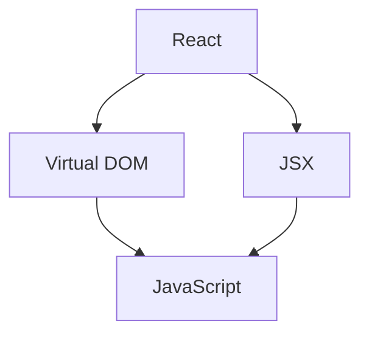

# SparseMap vs LinkLog v3 功能对比分析

基于对 [LinkLog v3](https://github.com/CharlieDeng-CD/linklog/tree/v3) 的分析，以下是功能对比和你可以实现的改进建议。

## 当前 SparseMap 已有功能

| 功能 | 状态 |
|------|------|
| 知识图谱生成（URL/文本输入） | ✅ 已实现 |
| Deep Dive 节点详解 | ✅ 已实现 |
| 动态概念关联（关联新概念） | ✅ 已实现 |
| 多 URL 合并分析 | ✅ 已实现 |
| 历史记录管理 | ✅ 已实现 |
| 布局切换（横向/纵向） | ✅ 已实现 |
| 格式化图谱 | ✅ 已实现 |

---

## 你感兴趣的两个功能

### 🎯 功能 1：渐进式节点展开/折叠

**LinkLog v3 实现方式：**
- 使用 React Flow 的自定义节点组件 (`CustomNode.tsx`)
- 每个节点有一个展开按钮（`ChevronDown` 图标）
- 节点数据包含 `expanded` 状态和 `onExpand` 回调
- 点击展开时调用 `/api/v2/expand` API 生成子节点
- 根据节点层级 (`level`) 控制是否显示展开按钮
- 已展开的节点会显示"已展开"标签

**关键代码片段：**
```tsx
// CustomNode.tsx
{data.level !== 0 && data.level !== 2 && (
  <button onClick={handleExpandClick}>
    <ChevronDown className={data.expanded ? 'rotate-180' : ''} />
  </button>
)}
```

**在 SparseMap 中实现的建议：**

| 步骤 | 描述 |
|------|------|
| 1. 修改数据模型 | 为节点添加 `expanded`、`level`、`hasChildren` 字段 |
| 2. 新增 API | 创建 `/api/expand-node` 端点，接收节点ID，返回子节点和边 |
| 3. 修改 Cytoscape 节点渲染 | 为可展开节点添加展开/折叠按钮 |
| 4. 实现动态加载 | 点击展开按钮时调用 API，动态添加子节点到图谱 |
| 5. 视觉反馈 | 已展开节点更改样式，显示折叠按钮 |

**复杂度评估：** ⭐⭐⭐ 中等

---

### 🎯 功能 2：图片继续提问

**LinkLog v3 实现方式：**
从 `V3ContextSidebar.tsx` 的代码来看，LinkLog v3 实现了一个聊天功能，但**并没有明确实现图片上传提问功能**。它的聊天功能是纯文本的：

```tsx
// V3ContextSidebar.tsx 中的聊天输入
<input
  onChange={(e) => setChatInput(e.target.value)}
  placeholder="输入你的问题..."
/>
```

**但是，你可以实现更高级的图片提问功能：**

| 方案 | 描述 |
|------|------|
| **方案 A：截图节点继续提问** | 用户可以截取图谱中某个节点的截图，上传后让 AI 解释或进一步分析 |
| **方案 B：上传学习材料图片** | 允许用户上传教材、笔记、PPT 截图，AI 将其与当前知识图谱关联 |
| **方案 C：多模态对话** | 在节点详情面板中支持图片 + 文字混合提问 |

**在 SparseMap 中实现的建议：**

| 步骤 | 描述 |
|------|------|
| 1. 前端 | 在 Deep Dive 面板底部添加聊天输入框 + 图片上传按钮 |
| 2. 后端 | 创建 `/api/chat` 端点，支持接收 `{ message, image_base64, node_context }` |
| 3. LLM 调用 | 使用支持多模态的模型（如 Gemini、GPT-4V）处理图片+文本 |
| 4. 上下文保持 | 将当前节点的 label、description 作为上下文传给 AI |

**复杂度评估：** ⭐⭐⭐⭐ 较高

---

## 额外可以借鉴的功能

| 功能 | 描述 | 优先级 |
|------|------|--------|
| **双引擎架构 (Mode A/B)** | Mode A: 从零开始生成图谱；Mode B: 基于用户已知知识差量生成 | 🔶 中 |
| **"我已知道这些"上下文优化** | 用户可以声明已掌握的知识，AI 会过滤掉这些节点 | 🔷 低 |
| **已知知识可视化** | 用虚线边框样式表示用户已掌握的知识节点 | 🔷 低 |
| **骨架加载动画** | 生成图谱时显示脉冲式的占位节点，减少等待焦虑 | 🔷 低 |

---

## 🔥 你的优先功能想法

### 1. 向量数据库集成

**目标：** 将知识点存储到向量数据库中，实现语义相似性搜索和知识回忆。

**使用场景：**
- 当你分析新内容时，自动检索以前学过的相似知识
- 提供"你之前学过类似的..."的回忆提示
- 跨 session 的知识积累

**可选技术方案：**

| 方案 | 特点 | 复杂度 |
|------|------|--------|
| **Chroma** | 本地嵌入式向量数据库，Python 原生 | ⭐⭐ |
| **Qdrant** | 高性能，支持本地或云端部署 | ⭐⭐⭐ |
| **pgvector** | PostgreSQL 扩展，可复用现有 PG 数据库 | ⭐⭐ |
| **Pinecone** | 托管服务，无需维护 | ⭐ |

**实现步骤：**
1. 选择向量数据库（推荐 Chroma 或 pgvector）
2. 在保存节点时，为每个节点生成 embedding
3. 新建 `/api/recall` 端点，接收查询文本，返回相似知识点
4. 在 UI 中展示"相关历史知识"卡片

---

### 2. 知识图谱导出

**目标：** 将图谱导出为可复用的格式，用于外部工具或持续对话。

**可选导出格式：**

| 格式 | 描述 | 适用场景 |
|------|------|----------|
| **Mermaid** | 文本描述的图谱，可直接嵌入 Markdown | 笔记、文档 |
| **DOT (Graphviz)** | 通用图描述语言 | 学术、可视化工具 |
| **JSON-LD** | 语义网标准，机器可读 | 知识库集成 |
| **D2** | Design as Code 语言 | 架构图、流程图 |
| **PNG/SVG** | 图片导出 | 分享、演示 |
| **Markdown 列表** | 层级结构文本 | 笔记、大纲 |

**示例 Mermaid 输出：**


**示例 D2 输出：**
```d2
React -> Virtual DOM
React -> JSX
Virtual DOM -> JavaScript
JSX -> JavaScript
```

---

## 功能优先级排序

根据你的反馈，更新后的优先级：

| 优先级 | 功能 | 状态 | 说明 |
|--------|------|------|------|
| 🔴 高 | 向量数据库集成 | 待开发 | 实现知识回忆功能 |
| 🔴 高 | 数据导出 | 待开发 | 支持 Mermaid/D2/JSON 等格式 |
| 🟡 中 | 渐进式节点展开 | 待开发 | 减少首次加载复杂度 |
| 🟢 低 | 侧边栏聊天 | 不优先 | 可用外部工具替代 |
| 🟢 低 | 图片/多模态对话 | 不优先 | 可导出后在 Gemini UI 中进行 |

---

## 备注

- **数据存储** ✅ 已自行实现
- **多模态对话** 暂不需要，可通过导出功能 + 外部 AI 工具实现
